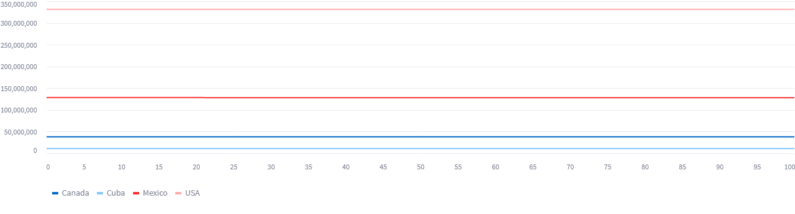

# Nations Development Simulation

### Integrantes

Lauren Guerra Hernandez C-312
Paula Rodríguez Pérez C-311
Dennis Fiallo Muñoz C-311

### Ejecución del programa

Para ejecutar el código, primero debe instalar las dependencias de Python que se encuentran en los requirements.txt con `pip install -r requirements.txt`. Luego ejecuta `streamlit run main.py` con el terminal en la dirección de la carpeta src, en caso de estar en otra dirección debes incluir la dirección en el comando `streamlit run <dirección>main.py`, luego la interfaz visual se muestra en el navegador predeterminado.

### Introducción

El objetivo que se persigue con este poryecto es facilitar, mediante el uso de un DSL propio, la generación de simulaciones sobre el desarrollo de  Naciones en un tiempo definido y las respuestas de estas naciones a ciertos eventos, para luego recopilar datos sobre los cambios territoriales, el desarrollo de las diferentes esferas de la economía y situación de la población y con estos analizar el desarrollo que esta sea capaz de alcanzar, en una esfera particular o de forma general.
Para esto el usuario tiene la facilidad de crear naciones, decisiones y eventos con sus categorías y distribuciones con todas las libertades que le ofrece el proceso de simulación definido.


### Modelo de Simulación

Se define la simulación como un sistema que se basa principalmente en eventos, aunque el tiempo, el cuál en la simulación se lleva como días transcurridos, también juega un papel importante en cuanto a en que momento se ejecuta cada evento. Para esto se utiliza una cola de prioridad modificada en la cual se almacenan los eventos, este Heap en lugar de devolver un solo elemento cuando se le hace pop, devuelve todos los eventos que tengan el mínimo valor de prioridad. La prioridad de un evento se define como el tiempo en días en el cual se ejecutará, es decir, el número del día en el cual se ejecutará el evento es la prioridad de este. En cada paso de la ejecución se pide todo el grupo de eventos que tengan la menor prioridad y se mandan a ejecutar todos de forma secuencial. En cada evento se puede definir si se repite o no, en caso de que se repita se agrega de nuevo al Heap con la prioridad correspondiente al tiempo en el cual se ejecutará nuevamente, para obtener este tiempo se obtiene una variable aleatoria a partir de la distribución que se le haya asignado al evento. También se pueden desactivar eventos, en caso de que se desee que no se ejecuten en adelante, esto con poner en `false` la propiedad `enabled` del evento y en caso de que se desee activar un evento basta con poner su valor en `true`.

Toda la simulación se desarrolla en un mismo mapa, en este se definen tanto elementos físicos como son los mares y naciones con todas sus propiedades, como todos los elementos importantes que están relacionados con el proceso de la simulación que son los eventos, decisiones, distribuciones y funciones. Todos estos elementos se pueden crear y modificar desde el DSL.

Las naciones se definen como agentes inteligentes, las cuales reaccionan a los cambios en el medio, como la simulación está dirigida por los eventos que ocurren, cada nación al ocurrir un evento que le afecte responde a este, tratando de contrarrestar sus efectos negativos. Para esto se utilizó la planificación, para con todas las decisiones posibles a tomar por las naciones se realice una selección ordenada de decisiones que le permitan lograr el objetivo que se propone. Estas decisiones están definidas como las acciones usuales que lleva la planificación, tienen una precondición y un efecto, que en este caso es un evento que define el cambio que se le realiza a la nación que tome esa decisión. 

Los eventos en el mapa están separados en dos tipos, los eventos de la simulación y los eventos que forman parte de la ejecución de las decisiones. Los eventos de simulación son los que se ejecutan en cada paso de la simulación, estos eventos son los que modifican el estado del mapa, o de algunas naciones en caso de que sea definido de esta forma específica. Los eventos de las decisiones son los que se ejecutan cuando una nación toma una decisión, tambien son los que se utilizan dentro del algoritmo de planificación como acciones para cambiar de estado.

Las decisiones son las acciones que pueden tomar las naciones para lograr sus objetivos. Una decisión está formada por una precondición que debe cumplirse para que la nación pueda tomar la decisión, y un efecto que es un evento que se ejecuta cuando la nación toma la decisión.

El flujo de la simulación consta de los siguientes pasos:

+ Se toman todos los eventos de cola de prioridad que tengan el menor tiempo.
+ Cada evento se ejecuta, en caso de que se deba generar se agrega de nuevo a la cola de prioridad con el tiempo en el cual se ejecutará nuevamente, obtenido de una variable aleatoria generada a partir de la distribución propia del evento.
+ Se buscan los cambios ocurridos en el mapa, en específico en cada nación y la que presente cambios negativos se realiza la planificación con el objetivo de llevar esta característica dañada a su valor anterior, los eventos generados por las decisiones se agregan a la cola de prioridad con el tiempo en el cual se ejecutarán, obtenido a partir de una disttribución uniforme.
+ se repiten los pasos anteriores hasta que se alcance el tiempo máximo de la simulación.


##### Elementos de la Simulación

El modelo de simulación que se implementó se va a dividir en dos tipos de eventos:

+ **simulation event**: Evento que va a pertenecer a la simulación agregandose a una cola de prioridad según el tiempo en que se debe ejecutar. Este va a estar constituido por:
    + **distribution**: Distribución de la cual se va a tomar la variable aleatoria de las siguiente ejecución del evento.
    + **category**: Categoría a la que pertenece este evento, esto se usa para diferenciar los tipod de eventos y sus posibles acciones a tomar. Se usa como apoyo para la heurística de la toma de decisiones.
    + **enabled**: Valor buleano que define si al inicio de la simulación el evento va a pertenecer a la cola de ejecución.

+ **decision event**: Evento destinado a ejecutarse como respuesta a ciertos cambios en el mapa. Este cuenta con:
    + **category**: Categoría a la que pertenece este evento, esto se usa para diferenciar los tipos de eventos y sus posibles acciones a tomar. Se usa como apoyo para la heurística de la toma de decisiones.

Los elementos principales de la simulación serían:

+ **nation**: Toda la simulación gira en torno a estas. Poseen ciertas características por defecto, pero es posible agregarle todo tipo de datos que sean necesarios para la simulación que se plantea.
    + **population**: Cantidad total de habitante.
    + **extension**: Extensión total de esta.
    + **neighbors**: Lista de naciones vecinas. Solo es necesario agregar como vecino en una de las naciones vecinas.
    + **kwargs**: Es posible agregar cualquier dato que se desee para la simulación.

+ **sea**: Elemento necesario en algunas simulaciones.
    + **extension**: Extensión total de esta.

+ **map**: Elemento que se usa coomo contenedor de todos los elementos de la simulación. Este es único y es generado la primera vez que se corre el código.


Como apoyo a la simulación se tienen los siguientes elementos que se pueden crear:

+ **decision**: Es donde se plantea el momento en que se va a ejecutar un **decision event** en caso de cumplirse la condición de activación. Este contiene:
    + **decision event**: Evento que debe ser ejecutado cuando se cumple la condición.
    + **precondition**: Condición para que se tome la decisión.

+ **distribution**: En un principio se cuenta con las 123 distribuciones básicas que brinda el módulo de Python `scipy`. Para generar una nueva distribución es necesario:
    + **distribution**: Una de las distribuciones básicas.
    + **args/kwargs**: Se puede agregar cualquiera de los argumentos que se le pasan a una distribución de `scipy`.

+ **category**: Elementos utilizado para agrupar a los eventos en conjuntos según algunas características en común.


Para ejecutar la simulación se usa el método `simulate` al cual se le pasan los siguientes parámetros:
+ **simulate**: Método que ejecuta la simulación.
    + **tiempo**: Tiempo máximo de la simulación.
    + **cantidad**: Cantidad de veces que se va a ejecutar la simulación. Este parámetro es opcional y por defecto es 1.

Luego de ejecutar la simulación todos los cambios que se realizaron en el mapa se almacenan en el elemento `logs` el cual contiene los `log` de cada simulación enumerados por el número de simulación(Ej: `log1`, `log2`, ...). Cada `log` contiene en cada tiempo de la simulación los eventos que se ejecutaron y los cambios que se realizaron en el mapa.

Es posible acceder a la lista de logs usando `logs->all`. Para acceder a un log en particular solo se debe escribir el nombre del log, por ejemplo `log1`.

Para la visualización de los resultados se cuenta con un módulo que permite generar gráficos de barras, líneas y area, además de permitir visualizar los dataframes de estos. Para esto se debe agregar un **plot** a la simulación, este contiene:

+ **plot**: Visualización que se desea realizar.
    + **log**: Log que hace referencia a los datos de la simulación que se desea visualizar. Este puede ser un log en particular o una lista de logs.
    + **nación**: Nación que se desea visualizar. Este puede ser una nación en particular o una lista de naciones.
    + **dato**: Dato que se desea visualizar. Este puede ser un dato en particular o una lista de datos.
    + **tipo**: Tipo de gráfico que se desea visualizar. Hay 4 tipos de gráficos: `bar`, `line`, `area` y `dataframe`.

Para el caso de este método `plot` solo uno de los parámetros `log`, `nación` y `dato` puede ser una lista, los otros dos deben ser un solo elemento.

### Inteligencia Artificial


#### Planificación y A*

El algoritmo de planificación utilizado primeramente se define de forma general para que con este algoritmo se pueda resolver cualquier problema de planificación que herede de `PlanningProblem`,para esto solo debe contar con un estado inicial, una lista de acciones, cada una definida como `Action` o derivada de esta, las que son decisiones en el problema específico, y una función que pasado un estado devuelva si este es la meta a alcanzar o no. Para este problema en específico se definió una clase `PlanningDecisions` que hereda de `PlanningProblem` y que define todo lo necesario y además una función heurística que se explica más adelante.


Para desarrollar la planificación se utilizó un algoritmo de búsqueda con un recorrido que simula un BFS, este se detiene cuando encuentra la meta especificada o alcanza el máximo número de pasos especificado, en caso de que no se encuentre la meta se devuelve `None`. 

Para mejorar el rendimiento de este algoritmo se utilizó una función heurística que en un estado, para cada acción que se puede tomar se calcula un valor estimado de tomar esta acción, esto a partir de la distancia que está el estado actual del estado meta y se toman en cuenta también las categorías de la acción y del evento al que se está dando respuesta, esto para que se prioricen las acciones que se encuentren más cerca del estado meta y que sean de categorías más similares. Con el costo de la heurística y  el costo de la acción se calcula (en este caso igual a 0) el valor final de la acción, `f(s)=g(s)+h(s)`, por lo que algoritmo de búsqueda + heurística = A*. En este punto también para acciones con un valor superior al estimado se quitan de la posibilidad de ser escogidas, de las acciones que quedan luego de esta poda se colocan en la cola cada una de estas acciones con el estado que generan y además se va construyendo un árbol para cuando se llegue al estado meta sea posible devolver cada estado con la acción que lo genera y tomar en orden todas las acciones a realizar.

#### NLP

Para facilitar el trabajo del usuario en cuanto a la busqueda de información real sobre las naciones se implementó un sistema de procesamiento de lenguaje natural que permite al usuario ingresar una pregunta en lenguaje natural y obtener los resultados de la busqueda en forma de dataframe.

Para el procesamiento de lenguaje natural se utilizó la biblioteca `spacy` de python, la cual permite realizar el análisis de texto en inglés, así como el análisis de las entidades nombradas en el texto. Para el caso de este proyecto se utilizó el modelo `en_core_web_sm` el cual es un modelo entrenado con datos de wikipedia y otros textos en inglés. Por otra parte, se hace uso de una API de **World Bank Data** en Python para obtener información de las naciones del mundo.

El procesamiento de lenguaje natural se realiza en la función `process_text` de la clase `NLP`. En un principio el texto de la consulta es normalizado para eliminar `stopwords` y dejar solamente el `lema` de las palabras, esto con el fin de que el usuario pueda ingresar una consulta en lenguaje natural y que el sistema pueda entenderla. Luego se realiza el análisis de texto y se obtienen las entidades nombradas, las cuales se utilizan para determinar la consulta que se quiere realizar. Haciendo uso de las funciones de Matching de `spacy` se determinan las entidades nombradas que se encuentran en el texto, así como el tipo de entidad que es, si es un país, un año o un tipo de dato de la nación, para luego realizar la consulta a la API de **World Bank Data**.

Para el caso de los match se utiliza la clase `NLPMatch` la cual se apoya en el `Match` de `spacy`. Para el caso de las naciones se crea un `Matcher` que busca coincidencias de `tokens` a partir de un patrón determinado para cada país, para los años se utiliza uno con un patrón de 4 dígitos, y para los tipos de datos se utiliza un `Matcher` que busca coincidencias de `tokens` a partir de un patrón determinado para cada tipo de dato.

Luego de tener las entidades se pasa a realizar la consulta a la API de **World Bank Data**. Para el caso de las naciones ya se sabe el nombre de estas y su código ISO, por lo que se realiza la consulta a la API con el código ISO de la nación y el tipo de dato que se quiere obtener. Para el caso de los años solo se tienen datos desde 1960 hasta la actualidad.

Al final es retornada una o varias tablas con los datos obtenidos de la consulta según el tipo de consulta que se haya realizado.


### DSL

Para facilitar la creación de escenarios para la simulación se implementó un Lenguaje de Dominio Específico que además de permitir la creación de forma sencilla de una simulación desde cero, creando cada uno de sus objetos y procesos, tiene la característica de que es Turing-Completo, por lo que cualquier programa es implementable con código del DSL.

##### Arquitectura del compilador y gramática

Para la lexemización, tokenización y parser se utilizaron los tokens definidos en `lexer.py` y la biblioteca de python `SLY`. Esta es una biblioteca para escribir analizadores y compiladores. Se basa libremente en las herramientas tradicionales de construcción de compiladores lex(tokenizar) y yacc (yet another compiler-compiler).

Para la obtención del AST se utilizó el algoritmo de análisis sintáctico (parser) LALR(1) implementado en `SLY`. Un analizador LALR (Look-Ahead LR)  es una versión simplificada de un analizador LR canónico, para analizar un texto de acuerdo con un conjunto de reglas de producción especificadas por una gramática formal para un lenguaje.

SLY utiliza una técnica de análisis conocida como análisis LR o análisis shift-reduce. El análisis LR es una técnica de abajo hacia arriba que intenta reconocer el lado derecho de varias reglas gramaticales. Cada vez que se encuentra un lado derecho válido en la entrada, se activa el método de acción apropiado y los símbolos gramaticales del lado derecho se reemplazan por el símbolo gramatical del lado izquierdo.

Al igual que con otros tipos de gramáticas LR, un analizador o gramática LALR es bastante eficiente para encontrar el único análisis de abajo hacia arriba correcto en un solo escaneo de izquierda a derecha sobre el flujo de entrada, porque no necesita usar el retroceso. El analizador siempre utiliza una búsqueda anticipada, representando LALR(1) una búsqueda anticipada de un token. Este parser presenta el inconveniente de que, como consecuencia de la técnica shift-reduce, no puede garantizar el análisis correcto en gramáticas ambiguas, siendo LR más poderoso en este aspecto.

El flujo que sigue el compilador es: pasar por el lexer para tokenizar el script con las clase `NDSLexer` que se ecuentra en `lexer.py`, luego pasa a parsear el código con `NDSParser` en `parser.py` el cual nos devuelve el AST del código, el cual se da como una lista de `ParserObj`. Ya con el AST se para a `execution.py` donde primero se hace un chequeo semántico donde en caso de errores lanza excepción para luego pasar a la ejecución de cada fragmento del código que se genera a partir del AST.

Todos los detalles acerca de las reglas de gramática utilizada se puede ver en `parser.out`, además de visualizar cada uno de los estados de la ejecución actual.

#### Diseño del Lenguaje

##### Tipos

- `element`: elementos que se usarán en la simulación, y se encuentran presentes en el mapa: `nation`, `sea`, `decision`, `distribution`, `category`, `simulation event`, `decision event` y `function`.
- `interger`: número entero.
- `decimal`: número flotante.
- `boolean`: booleano, puede ser `true` o `false`.
- `string`: cadena de texto.
- `list`: lista de elementos.
- `time`: tiempo el cual puede ser en años, meses o días(y, m, d respectivamente), se usa para definir los tiempos en la simulación.


##### Sintaxis

- Sintaxsis similar a Python en cuanto a las funcionalidades y dinamismo.
- Instrucciones separadas por `;`.
- Los bloques de código de los loops, condicionales y eventos se encierran en `{}`.
- Para el caso de los argumentos de las funciones o eventos se usa `()`.
- Parámetros y argumentos separados por `,`.
- Mientras que los parámetros se encierran en `<< >>`.
- Admite aritméticas como `+`, `-`, `/`, `//`, `*`, `**`, `%`.
- Uso de operadores `==`, `!=`, `>=`, `>`, `<=`, `<`.
- Uso de operadores lógicos `not`, `and`, `or`, `xor`.
- Para asignar las variables o hacer cambios en los valores de los `elements` se usa `=`.
- Para acceder a los valores de los elementos se usa `->`.
- Se puede asignar el tipo de los argumentos o el nombre de los parámetros usando  `:`.


##### Loops

- `repeat`: ciclo for desde un inicio hasta un final, ambos indicados.
- `foreach`: ciclo for iterando en una lista.
- `while`: ciclo while


##### Condicionales

- Clásicos `if` y `else`.

Para mejor comprensión del lenguaje generado se incluyó en la carpeta compiler un readme.m que ejemplifica como escribir código en este lenguaje.


#### Ejemplos de código DSL

```
    #categories
    category social();
    category economic();
    category political();
    category military();
    category territorial();

    #nations
    nation Canada(38246108, 9984670, [], [USA], industrialization: 70 , tourism:30);
    nation Mexico(128455567, 1964375 , [], [USA], industrialization: 60 , tourism:70);

    #distributions
    distribution pg(expon, scale: 20);
    distribution ud(uniform, scale: 20);


    #decisions
    decision event industrialization_increases(economic)<<n>>{
        n->aviable_economic_resources = n->aviable_economic_resources-500;
        n->industrialization = n->industrialization*1.2;
    }    
    decision industrialization_increases_dec(n->aviable_economic_resources >= 5000, industrialization_increases)<< n >>;


    #events
    simulation event decrease_industrialization(pg,economic,true,[]){
        foreach <<nat>> (map->nations){
            nat->industrialization=nat->industrialization*0.9;
        }
    }

    simulation event population_growth(ud, social, true, []){
        foreach <<nat>> (map->nations){
            nat->population= irvs(expon, loc: nat->population);
        }
    }


    #simulation
    simulate(20y, 10);


    #plots
    #log list
    plot(log1,  Cuba, 'tourism'  , 'line');
    #nation list
    plot(log5, [Cuba, Canada], 'tourism' , 'bar');
    #data list
    plot(logs->all, Cuba, ['tourism', population'], 'dataframe');

    #nlp
    info('What is the population and net migration of Cuba? And from Canada and Mexico in 2010 the population');

```
### Ejemplo de Simulación realizada

Para probar el funcionamiento del presente se desarrolló una simulación en la que se tiene como objetivo la observación del comportamiento la migración de personas en cada nación a partir de su situación social y económica. Para esto se definieron eventos que afectan tanto la economía de los países como la vida de la población de estos, y se definieron decisiones afines a estos eventos. El código de esta simulación de ejemplo se encuentra en la carpeta `example_simulations` en `example_1.py` y se corre desde `simulation_example.py`. 

Para todos los valores iniciales de los recursos que poseen los países se buscó en internet en el sitio oficial de **World Bank Data**, mientras que para los casos de las distribuciones y los eventos se usan datos extraídos en **Wikipedia**. Para esto se usaron los datos más actualizados de cada tipo.

Para obtener los resultados que se muestran a continuación, como consecuencia de la baja potencia computacional con que contamos y gran costo espacial que requieren las simulaciones, se realizaron 10 simulaciones todas de 100 días, y se guardaron los todos los cambios que se realizan en el mapa en cada simulación, para luego obtener los promedios de los valores de cada recurso de cada país en cada simulación.

A continuación se muestran la utilización del visual para crear la simulación y observar los resultados obtenidos.

 *Creación de las distribuciones, categorías y países.*

 *Creación de las decisiones.*

 *Creación de las los eventos de la simulación parte 1.*

 *Creación de las los eventos de la simulación parte 2.*

 *Resultado de la simulación de variaciones en la industrialización en las naciones.*

 *Resultados de la simulación de variaciones en los recursos como ejemplo para la nación USA.*

 *Gráfico de la población de las naciones. Como se ve demasiado lineal porque los cambios son muy pequeños con respecto a los valores que se representan, se observa a continuación los datos representados en un dataframe.*

 *Dataframe de la población de las naciones donde se observan, solo para los primeros 20 días, las variaciones en la población de cada nación.*

 *Esta gráfica muestra la migración de personas de cada nación a lo largo de los 100 días simulados, representa en cada día la diferencia entre la cantidad de personas que abandonan la nación y la cantidad que migran hacia ella.*

Se puede observar que la migración de personas es un proceso  que depende de muchos factores, con los factores que se tuvieron en cuenta en esta simulación se observa que la migración de personas disminuye con el tiempo en las naciones que tienen un mayor desarrollo económico dado por sus recursos económicos, mayor nivel de vida promedio y menores niveles de pobreza, taza de crimilnalidad y nivel de inflación. Esto se puede deber a que las personas buscan un mejor nivel de vida, y que las naciones con estas características. Esto se puede ver en la gráfica de migraciones, donde naciones como Cuba y México, las cuales son países con poco nivel de desarrollo, tienen una migración que va en aumento en todo momento, es decir, que más personas abandonan la nación que las que llegan, mientras que naciones como USA y Canadá, que aumentan su desarrollo a lo largo de la simulación, comienzan con una migración negativa y rápidamente su curva comienza a bajar, lo que significa que más personas llegan a la nación que las que se han ido. 

### Conclusiones

El presente proyecto funciona debidamente y cumple con su objetivo de ser una herramienta relativamente sencilla de utilizar para la simulación del desarrollo de naciones. Se puede observar que la simulación de eventos en un mapa de naciones es un problema complejo y que requiere de una gran cantidad de recursos computacionales para poder ser simulado de manera eficiente, por lo que no se recomienda utilizar este proyecto para simulaciones largas y una gran cantidad de simulaciones a la vez ya que el costo espacio y tiempo es muy alto.


### Bibliografía

1. Dr. Luciano García Garrido, Lic. Luis Martí Orosa, Lic. Luis Pérez Sánchez: Temas de Simulación.
2. Documentación de scipy https://docs.scipy.org
3. Stuart Russell, Peter Norvig: Artificial Intelligence a Modern Approach Fourth Edition.